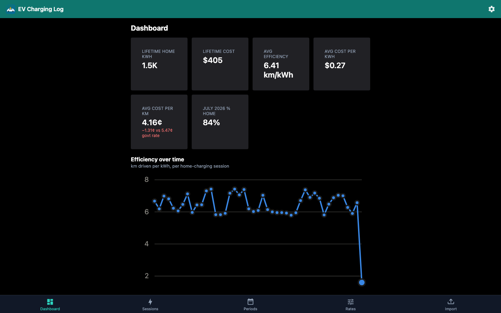
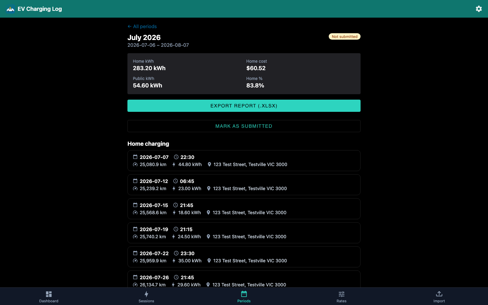
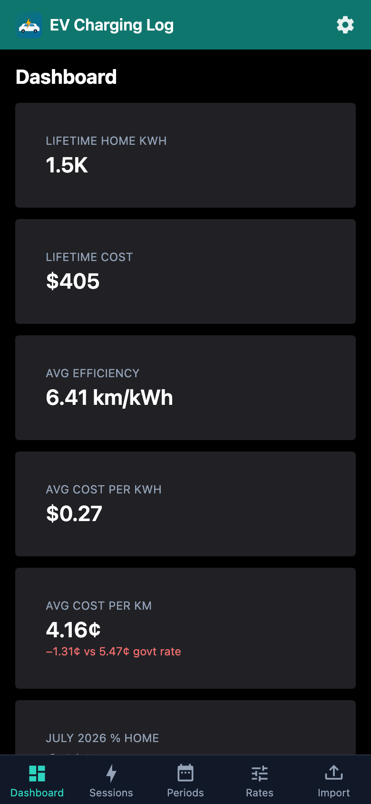
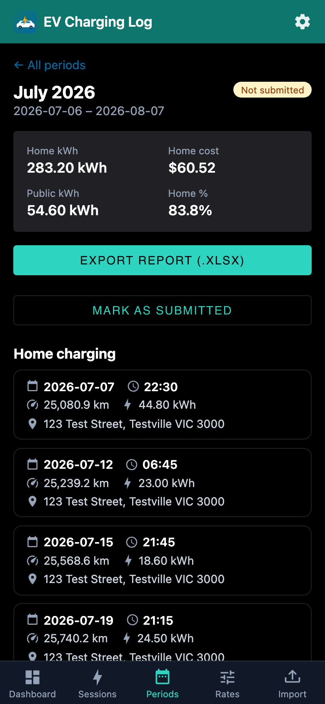

# EV Charging Log

A small self-hosted app for tracking EV charging sessions (home + public),
splitting cost across flat-rate or peak/off-peak electricity plans, and
generating lease-company billing reports — replacing a manual spreadsheet
workflow.

Built for a single user / single vehicle. No accounts, no auth — designed to
run on a home network (Unraid).

See [PLAN.md](PLAN.md) for the full project plan, data model, and build phases.

## Screenshots

### Desktop

| Dashboard                                                                          | Billing period detail                                                                              |
| ---------------------------------------------------------------------------------- | -------------------------------------------------------------------------------------------------- |
|  |  |

### Mobile

| Dashboard                                                                        | Billing period detail                                                                            |
| -------------------------------------------------------------------------------- | ------------------------------------------------------------------------------------------------ |
|  |  |

## Features

- Log home and public charging sessions (time, date, odometer, kWh, location).
- Flat-rate or peak/off-peak electricity plans, versioned by effective date.
- Per billing-period reports matching the format expected by a lease company,
  exported as a filled-in `.xlsx`.
- Import historical spreadsheet data.
- Personal dashboard: km/kWh efficiency trend, home vs public charging split,
  cost over time.
- Installable PWA, mobile-first UI.

## Tech stack

- **SvelteKit** (TypeScript) — single app, no separate backend service.
- **SMUI** (Svelte Material UI) for the component layer.
- **SQLite** via Drizzle ORM + `better-sqlite3`.
- **exceljs** for spreadsheet import/export.
- **Vitest** for testing calculation logic.
- Deployed via **Docker** (PUID/PGID-aware) to a home Unraid server.
- Optional **Electron** desktop build (macOS, unsigned) for personal use
  alongside the Docker deployment.

## Developing

Install dependencies with `npm install`, then start a dev server:

```sh
npm run dev

# or start the server and open the app in a new browser tab
npm run dev -- --open
```

Migrations apply automatically on server boot (see `src/hooks.server.ts`). If
you change `src/lib/server/db/schema.ts`, generate a new migration file with:

```sh
npm run db:generate
```

## Building

To create a production version of the app:

```sh
npm run build
```

You can preview the production build with `npm run preview`.

## Deploying

`docker build -t ev-charging-log .` builds a production image with a
linuxserver.io-style `PUID`/`PGID` entrypoint (see `docker/entrypoint.sh`) so
files written to the mounted `/data` volume end up owned by the right user —
no docker-compose needed. On Unraid, use the template at
[unraid/ev-charging-log.xml](unraid/ev-charging-log.xml).

## Desktop app (Electron)

For personal convenience, the same app can also run as a self-contained macOS
desktop app instead of (or alongside) the Docker deployment — see
[PLAN.md §11](PLAN.md#11-electron-desktop-distribution-optional-alongside-docker)
for the full design. It bundles the production `adapter-node` build and runs
it as a local child process, with an Electron window pointed at
`http://127.0.0.1:<port>`; by default the SQLite database lives under the
OS's per-app data directory (`~/Library/Application Support/ev-charging-log`
on macOS) as its own separate dataset from any Docker deployment.

To have the desktop build read/write the _same_ database as an existing
Docker deployment instead (e.g. a file shared over a network mount), create
`config.json` in that per-app data directory before first launch:

```json
{ "databasePath": "/path/to/ev-charging-log.db" }
```

Run it in dev mode (rebuilds first, then launches Electron against that
build):

```sh
npm run electron:dev
```

Package a distributable `.dmg`/`.zip` with `electron-builder`:

```sh
npm run electron:build
```

Output lands in `release/`. This is a single-user, unsigned, macOS-only build
for now — no auto-update, no Windows/Linux target, no code signing/
notarization (see PLAN.md §11.5 for what's intentionally left out).

## Status

Core features are built: session logging, rate plans (flat + peak/off-peak),
billing periods with xlsx report export, historical import, a personal
dashboard, and settings — all mobile-first with SMUI, running as a PWA. See
[PLAN.md](PLAN.md) for the original design and remaining open items (§10),
such as confirming real peak/off-peak rates once you're on that plan.

## Prompts

Prompts used to drive notable changes via Claude Code, kept for reference.

- "Fix: For a mobile-first app, the Periods view page is very unfriendly with
  excessing x-scroll. Rework this area to be far more mobile friendly, this is
  already achieved in the Sessions history relatively well (though has less
  data it needs to show)." — reworked the period detail page's home/public
  session tables from horizontally-scrolling `DataTable`s into stacked cards
  matching the Sessions history list.

## A note on privacy

This project handles personal data (vehicle details, home address, charging
history). Raw spreadsheets, the live SQLite database, and `.env` files are
gitignored and must never be committed — see [.gitignore](.gitignore).
